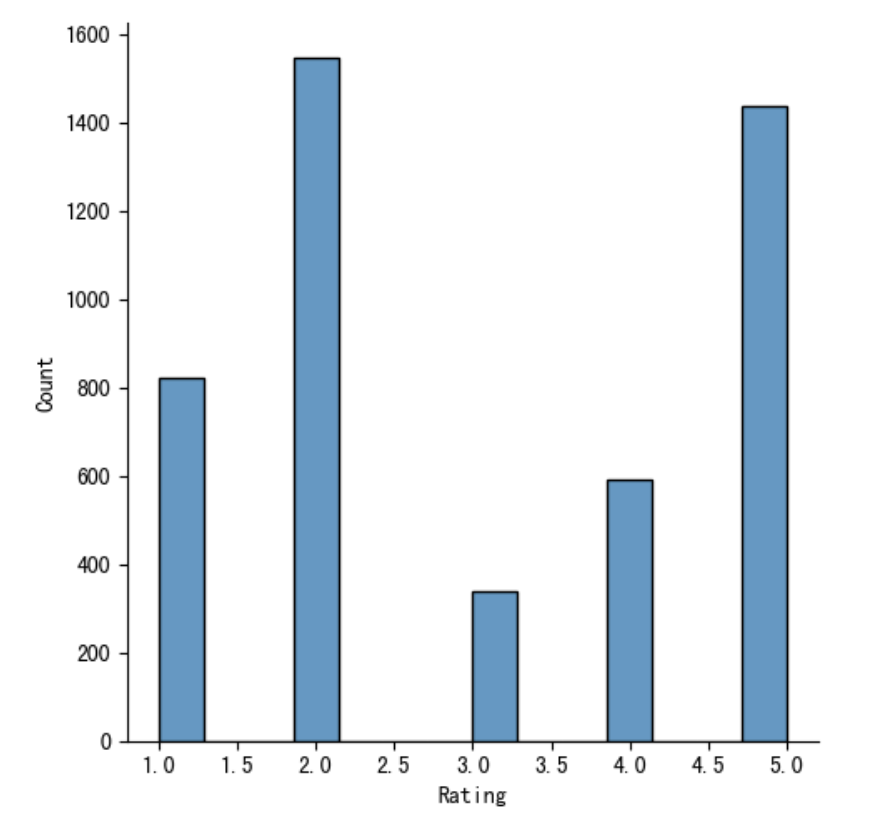

##### Problem Description

Sentiment classification of product reviews is a common application in business settings. I found a suitable dataset on Kaggle called "Women's E-Commerce Clothing Reviews" (https://www.kaggle.com/datasets/nicapotato/womens-ecommerce-clothing-reviews). This dataset is a real women's e-commerce dataset that focuses on customer reviews. It should be noted that the dataset has been anonymized and shop information in the reviews has been converted to "retailor". The dataset has a total of 23,486 rows, each corresponding to a customer review, including 10 feature variables.

We will need to use the Review Text (text content of the review) and Rating (customer rating score from 1-5) fields for this task. The text will be used as the corpus for training the classification model, while the rating can be processed to represent the sentiment label indicating whether the customer is satisfied or not. Therefore, the objective of this task is a binary classification task.

##### Logistic Regression

We will use TfidfVectorizer to train the vector_transformer (fit training set text), then transform the test set text input into the trained vector_transformer to obtain the text vectors.

We will use LogisticRegression for training and prediction, outputting the classification results.

##### BERT

We will download the pre-trained "bert-base-uncased" BertTokenizer. We will apply special tokens to the dataset text, with the CLS token indicating the start and the SEP token indicating sentence breaks. After being transformed by the tokenizer, the text will become tokens_tensor. At the same time, the labels will be transformed into label_tensor. We will set batchsize to an empirical value of 32 or 63, and use DataLoader to pack the data into batches, with each sample paired with corresponding tokens_tensors, masks_tensors, and label_ids.

We will download the pre-trained BertForSequenceClassification. The fine-tuning part of the model will adjust the optimal parameters using gradient descent algorithm.

We will rent a GPU to train the model, and set the initial value of epoch to 5. We will iteratively train the model, with predictions made after each round of training to output the accuracy of the training set and test set based on the current model parameters. When the test set accuracy begins to decrease, indicating overfitting has occurred, we will stop the iteration.

##### Comparative Analysis

When the dataset is balanced, the machine learning model (with an accuracy of 0.85) does not perform as well as the deep learning model (with an accuracy of 0.88). In terms of feature extraction, BERT uses a bidirectional Transformer to extract features that include contextual information. Compared to machine learning models like RL that use TfidfVectorizer to represent text based on word frequency vectors, BERT considers the position of words, while the latter only considers the presence of words themselves.

However, there is a problem with this approach. Consider the following review: "I originally expected this product to be very good, but it turned out to have poor quality." The features learned by TfidfVectorizer may confuse the machine: is it good or poor? By contrast, using a pre-trained model with a tokenizer that takes into account contrastive meanings (like "but") can identify the sentiment in the second half of the sentence where the customer's true feelings are expressed, resulting in more accurate classification. According to statistical analysis, only 32.9% of the reviews in the dataset do not have contrastive words, and more than 30% of the reviews have two or more contrastive words, which would be more confusing for traditional machine learning models.